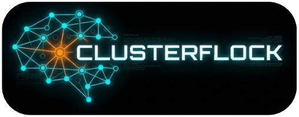
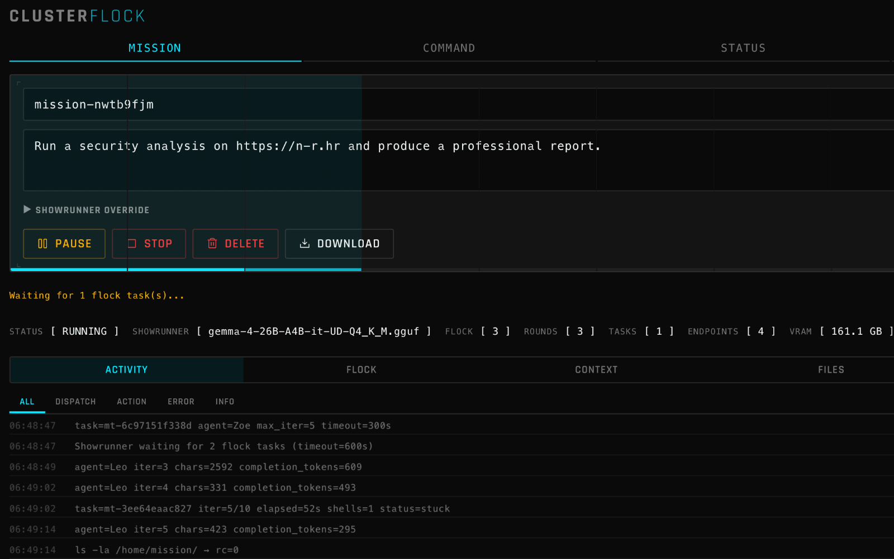

<p align="center">
  
</p>

<p align="center">
  <em>ClusterFlock auto-deploys best models for your hardware and connects them together.</em>
</p>

<p align="center">
  
</p>

<hr>


# ClusterFlock

A distributed AI orchestrator that manages heterogeneous hardware - NVIDIA GPUs, Apple Silicon, DGX systems - loading optimal models on each device and coordinating them to complete autonomous "missions".

**License**: MIT &nbsp;|&nbsp; **Python**: 3.10+ &nbsp;|&nbsp; **nCore port**: 1903 &nbsp;|&nbsp; **OAPI port**: 1919

---

## What is ClusterFlock?

ClusterFlock unifies mixed GPU hardware into a single AI backend. One **nCore** orchestrator manages many **agents** - each running on a different machine with different hardware.

```
                    ┌─────────────────────────────────┐
                    │       nCore (port 1903)         │
                    │  orchestrator · registry · OAPI │
                    │  missions · access · catalog    │
                    └──────┬──────┬──────┬─────┬──────┘
                           │      │      │     │
              ┌────────────┘      │      │     └────────────┐
              │                   │      │                   │
        agent_spark          agent_linux  agent_mac      agent_lms
        (DGX/GB10)           (amd64+CUDA) (Apple Silicon) (LM Studio)
        llama.cpp+CUDA       llama.cpp    llama.cpp+Metal  LM Studio CLI
```

Key features:
- **Zero-touch model provisioning** - auto-profiles hardware, bin-packs models to VRAM
- **Autonomous missions** - a showrunner LLM coordinates a flock of worker LLMs in Docker containers
- **OpenAI-compatible API** - drop-in replacement on port 1919 (fanout, speed, manual routing)
- **Zero third-party deps for nCore** - the orchestrator is pure Python stdlib
- **4 agent types** - DGX Spark, generic Linux+CUDA, Apple Silicon, LM Studio

---

## Install

### 1. Clone the repo

```bash
git clone --recurse-submodules https://github.com/notum-robotics/ClusterFlock.git
cd ClusterFlock
```

> The `--recurse-submodules` flag pulls the llama.cpp source used by agent_spark. If you forgot it, run `git submodule update --init` afterwards.

### 2. Install dependencies

nCore itself needs **nothing** beyond Python 3.10+ - it's pure stdlib.

Agents that download models from HuggingFace need one package:

```bash
pip install huggingface_hub
```

Build prerequisites (for agents that compile llama.cpp locally):

| Agent | You need |
|---|---|
| agent_mac | Xcode Command Line Tools (`xcode-select --install`), CMake |
| agent_linux | `build-essential`, CMake, NVIDIA drivers (CUDA toolkit only for building) |
| agent_spark | CMake, CUDA toolkit |
| agent_lms | [LM Studio](https://lmstudio.ai) installed |

### 3. Start nCore (the orchestrator)

```bash
python3 nCore/run.py
```

That's it. nCore starts on port **1903** (API) and **1919** (OpenAI-compatible endpoint). Open `http://localhost:1903` in a browser to see the dashboard.

### 4. Add your first agent

Pick the agent that matches your hardware and run the interactive setup. It will build llama.cpp, profile your GPU, pick a model, and connect to nCore.

**Mac (Apple Silicon):**
```bash
cd agents/agent_mac
python3 run.py setup
```

**Linux with NVIDIA GPU:**
```bash
cd agents/agent_linux
./build.sh            # one-time: compiles llama.cpp
python3 run.py setup
```

**DGX Spark:**
```bash
cd agents/agent_spark
python3 run.py setup
```

**LM Studio (any platform):**
```bash
cd agents/agent_lms
python3 run.py setup
```

Setup will ask for the nCore address (default `http://localhost:1903`) and register with the cluster. Once connected, the agent shows up in the dashboard and nCore auto-loads the best model for your hardware.

### 5. Run in production

For long-running deployments, use the watchdog (auto-restarts on crash):

```bash
python3 watchdog.py
```

### 6. Try it out

```bash
# Chat via the OpenAI-compatible API
curl http://localhost:1919/v1/chat/completions \
  -H "Content-Type: application/json" \
  -d '{"model": "clusterflock", "messages": [{"role": "user", "content": "Hello!"}]}'

# Or launch an autonomous mission
curl -X POST http://localhost:1903/api/v1/missions \
  -H "Content-Type: application/json" \
  -d '{"mission_id": "my-task", "mission_text": "Build a calculator web app"}'
```

Missions require Docker on the nCore host. The first mission auto-builds a lightweight container image.

---

## Documentation

- [ClusterFlock.md](ClusterFlock.md) - full architecture, API reference, deployment guide
- [ClusterFlockOAPI.md](ClusterFlockOAPI.md) - OpenAI-compatible API documentation

## Web UI

nCore includes an optional web dashboard at `http://<host>:1903/`. The API is the primary interface; the web UI is just one consumer of it.

## License

MIT - see [LICENSE](LICENSE).

## Contributing

See [CONTRIBUTING.md](CONTRIBUTING.md).
